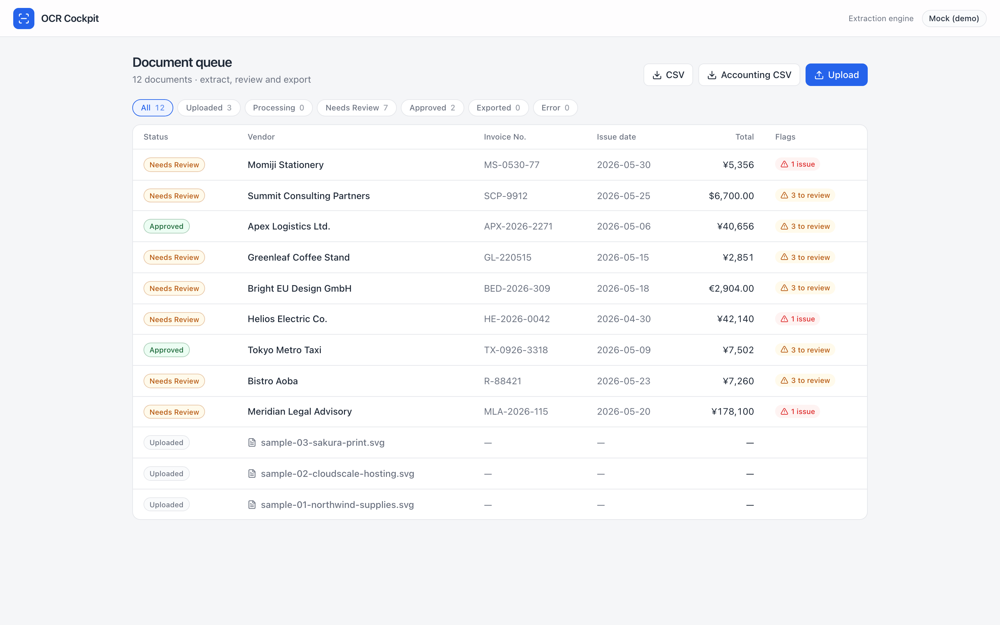
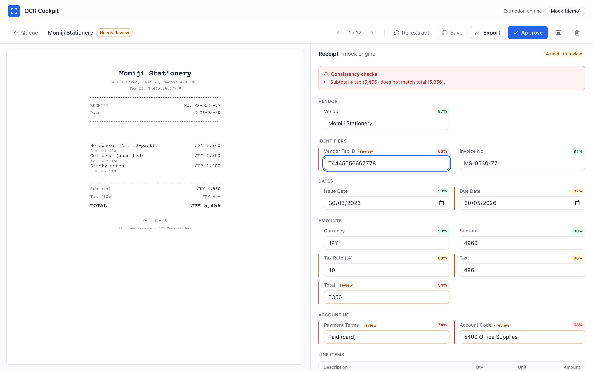
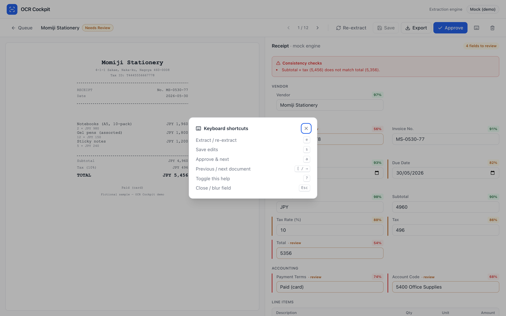

# OCR Cockpit

**Extract, review, correct and export invoice & receipt data — with field-level confidence.**

OCR Cockpit is the "confirm-and-correct" layer that sits between raw OCR and your
accounting system. You drop in an invoice or receipt, the engine pulls out the
vendor, dates, amounts, tax and line items, and you confirm them in a two-pane
review screen — document on the left, extracted fields (with confidence and edit
history) on the right — then export to CSV or an accounting-ready journal.

It is built as a **sales demo / portfolio piece**: the requirements were
distilled from real freelance and Upwork postings where clients repeatedly ask
for "preview on the left, extracted result on the right, let a human confirm and
fix, then output to a spreadsheet." The most common, most universal pain is that
*people are still reading documents and typing the numbers in by hand* — this
replaces the typing with review.

> The demo runs end-to-end with **zero external services**: a deterministic mock
> extractor and an in-process Postgres mean `npm install && npm run db:seed &&
> npm run dev` is all you need. Swap in a local Ollama model or Azure when you
> want real extraction.

---

## Screenshots

**Document queue** — extract / review / export, with status filters, counts and per-document flags.



**Review cockpit** — document preview beside the extracted fields, each with model confidence. Low-confidence fields are flagged "· review" and the consistency checks catch mismatches (here the extracted total doesn't match subtotal + tax).



**Keyboard-first** — the whole review loop runs from the keyboard.



> Screenshots are generated from the running app with Playwright: `npm run start` then `npm run screenshots` ([scripts/screenshots.mjs](scripts/screenshots.mjs)).

## Features

- **Two-pane review cockpit** — document preview beside editable fields, grouped
  by Vendor / Identifiers / Dates / Amounts / Accounting.
- **Field-level confidence** — every field shows the model's confidence; anything
  below threshold is flagged "to review" and the first low-confidence field is
  auto-focused.
- **Correction tracking** — edited fields show their original value; a per-document
  audit trail records uploads, extractions, edits, approvals and exports.
- **Consistency checks** — subtotal + tax vs. total, line-items vs. subtotal,
  missing vendor/date, surfaced as warnings.
- **Processing queue** — `Uploaded → Processing → Needs Review → Approved →
  Exported` with status filters and counts.
- **Keyboard-first** — `e` extract, `s` save, `a` approve & next, `[` / `]`
  previous / next, `?` help.
- **Learned vendor rules** — approving a document remembers that vendor's account
  code and tax rate and pre-fills them next time.
- **Exports** — flat CSV and an accounting-style journal CSV (freee / QuickBooks
  shaped). Approved documents flip to "exported".
- **Pluggable extraction** — `mock` (default), `ollama` (local/free) or `azure`
  (Azure AI Document Intelligence), selected by env.

## Architecture

```
PDF / image / email attachment
        │
        ▼
   OCR layer ── native PDF text (unpdf) · image OCR (tesseract.js) · SVG text
        │
        ▼
 Extraction provider ── mock | ollama (vision or text) | azure (prebuilt models)
        │  → validated JSON (zod) → field values + confidences
        ▼
   Review cockpit ── confidence, inline edit, consistency checks, audit
        │
        ▼
   Export ── CSV · accounting CSV · (rename / move / Sheets are easy extensions)
```

- **Frontend / BFF:** Next.js 16 (App Router) + React 19 + TypeScript + Tailwind v4.
  Route handlers under `app/api/*` are the backend-for-frontend.
- **Persistence:** Postgres. With **no `DATABASE_URL`** it uses
  [PGlite](https://pglite.dev) — real Postgres compiled to WASM, in-process,
  persisted to `./.pglite`, zero setup. Set `DATABASE_URL` to point at a real
  Postgres server and the data layer switches to `node-postgres` transparently.

## Quick start

```bash
npm install
npm run db:seed     # loads 12 fictional sample invoices/receipts (run with the dev server stopped)
npm run dev         # http://localhost:3030
```

Open the queue, click a "Needs Review" document, correct the flagged fields,
press `a` to approve, then export from the queue.

> `db:seed` resets the database and writes sample SVGs to `storage/samples`.
> PGlite is single-process — stop the dev server before re-seeding.

## Extraction providers

Set `EXTRACTION_PROVIDER` in `.env` (see `.env.example`).

| Provider | Cost | Notes |
|---|---|---|
| `mock` (default) | free | Deterministic. Returns the sample ground truth with a couple of fields perturbed/low-confidence so the review flow is realistic; synthesizes plausible data for real uploads. No services needed. |
| `ollama` | free / local | `OLLAMA_MODE=vision` sends the image to a multimodal model (`ollama pull llama3.2-vision`). `OLLAMA_MODE=text` OCRs the document (unpdf / tesseract.js) then structures it with a text model — works with the `llama3.2` you already have. |
| `azure` | paid | Azure AI Document Intelligence `prebuilt-invoice` / `prebuilt-receipt`. Returns field-level confidence natively. Needs `AZURE_DI_ENDPOINT` + `AZURE_DI_KEY`. |

You can override per request: `POST /api/documents/:id/extract?provider=ollama`.

## Selling it (Lite / Standard / Pro)

The same codebase sells in three tiers, matching how the real postings escalate:

- **Lite** — "drop a PDF, get a CSV / Google Sheet." Just upload → extract → export.
- **Standard** — the review cockpit: confidence, correction, consistency checks, audit.
- **Pro** — Gmail/Drive intake, vendor rules, duplicate detection, accounting CSV
  (freee / QuickBooks), then ERP/AP integration.

## Project structure

```
app/
  documents/            queue page + [id] review page (server components)
  api/                  BFF route handlers (documents CRUD, extract, file, export)
components/             cockpit UI (queue, review, field rows, preview, badges)
lib/
  types.ts              domain model + field registry
  db/                   dual-driver Postgres (PGlite / pg) + repository
  extraction/           provider interface + mock / ollama / azure + zod schema
  ocr/                  unpdf (PDF text) + tesseract.js (image) + svg text
  export/               CSV + accounting CSV
  samples/              fictional sample documents + SVG generator
scripts/                seed + sample generation (tsx)
storage/samples/        committed fictional sample documents (SVG)
```

## Environment

See [`.env.example`](.env.example). Nothing is required for the mock demo. `.env`
is gitignored — never commit keys.

## Notes

- All sample invoices/receipts are **self-authored fiction** — invented vendors,
  addresses and tax IDs. No real personal or client data.
- Uploaded files live in `storage/uploads/` (gitignored); the embedded database
  lives in `.pglite/` (gitignored).

## Security & trust model

This is a **single-user, local demo**. The API has **no authentication and no rate
limiting by design** — do not expose it to untrusted users as-is.

What *is* hardened (so the demo is safe to run and read):

- Parameterized SQL throughout the repository (no string-built queries).
- File serving is path-traversal-guarded (basename only) and served under a strict
  `default-src 'none'` CSP + `nosniff` + sandbox, so user SVGs can't execute script.
- Uploads are limited to a MIME allowlist (PDF / common image types) and 15 MB.
- CSV exports neutralize spreadsheet formula injection (leading `= + - @`).
- Provider URLs are validated: the Azure endpoint must be HTTPS and the async
  polling URL is pinned to that same origin (SSRF guard); `OLLAMA_BASE_URL` must
  be http(s). LLM output is validated with Zod before use.

Before multi-tenant / production use, add: authentication & sessions, per-user
rate limiting and storage quotas, a bounded extraction queue (cap concurrent
Ollama/Azure calls), and magic-byte content sniffing on uploads.

## License

MIT
