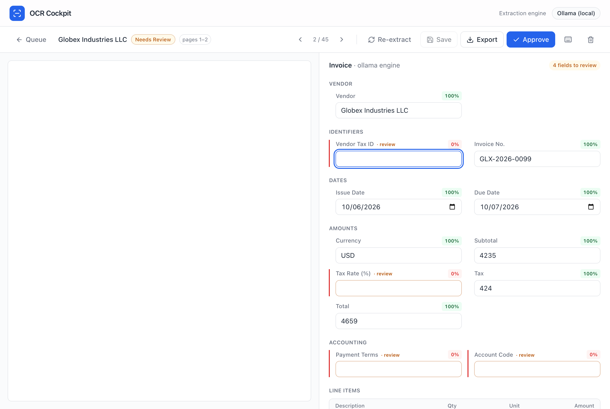
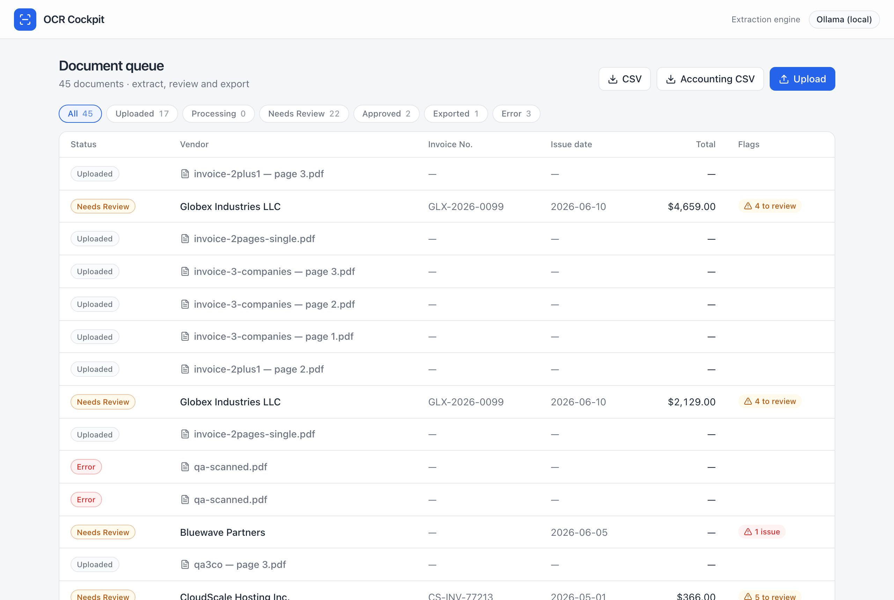

# PDF-type test results

End-to-end tests of how the cockpit handles different document types, run through
the real app (upload → extract → review) with the local vision engine
(`EXTRACTION_PROVIDER=ollama`, `OLLAMA_MODEL=qwen2.5vl:7b`; digital PDFs route to
text extraction). All inputs are **self-authored fictional documents — no PII**.
Generated with Playwright; last updated 2026-06-14.

## Results

| # | Document type | Outcome | Screenshot |
|---|---|---|---|
| 1 | **Digital invoice** (baseline) | ✅ Acme Trading Co. · ACM-2026-204 · USD 1,650 — all fields 100% | [01](01-invoice-digital.png) |
| 2 | **Single invoice across 2 pages** (line items span pages) | ✅ One document; **all line items captured from both pages**, no warnings | [02](02-twopage-single-invoice.png) |
| 3 | **Multiple invoices in one PDF** | ✅ **Auto-detected and split** into one document per invoice (no prompt); each page extracts its own invoice (e.g. CloudScale · CS-INV-77213 · USD 366) | [04](04-split-page2-cloudscale.png) · [08](08-autosplit-queue.png) |
| 4 | **Mixed: invoice spanning 2 pages + a 1-page invoice** ("2+1") | ✅ Auto-segmented into **pages 1–2** (one invoice, 55 line items merged) **+ page 3** (the other) | [07](07-autosplit-page-range.png) |
| 5 | **Non-invoice** (business letter) | ✅ Graceful: amounts **null**, "Total amount is missing" warning — nothing invented | [05](05-non-invoice-letter.png) |
| 6 | **Scanned / image-only PDF** (no text layer) | ✅ **Refused** with a clear error instead of fabricating | [06](06-scanned-no-text.png) |

## Auto-segmentation (no prompt)

On upload, a multi-page PDF is analyzed automatically and split into one document
per invoice — the user is **not** asked. Boundaries are detected from invoice
numbers, invoice/receipt headers, and totals:

- All pages share one invoice number → **1 document** (multi-page single invoice).
- Different invoice numbers → **split** at the boundary.
- A page with no invoice number → **continues** the previous invoice.

Verified groupings (unit + end-to-end):

| Input | Detected | Result |
|---|---|---|
| 3 different invoices (3 pages) | 3 invoices | 3 documents (1 / 2 / 3) |
| 1 invoice over 2 pages | 1 invoice | 1 document (pages 1–2) |
| invoice over pages 1–2 **+** invoice on page 3 | 2 invoices | 2 documents (**pages 1–2** + page 3) |

### "2+1" — invoice spanning two pages, then a separate invoice
Auto-split into a `pages 1–2` document (all 55 line items merged from both pages)
and a `page 3` document — no prompt:

Queue after auto-segmentation:

### A split page extracts its own invoice

## Other screenshots

### Digital invoice (baseline)

### Single invoice across two pages (kept as one)

### Non-invoice (business letter) — nothing invented

### Scanned / image-only PDF — refused, not hallucinated

## Key findings

- **Multiple invoices in one PDF are separated automatically** (no "split?" prompt) —
  important because uploaders often haven't looked at the content. Boundaries use
  invoice number / header / total heuristics; a single invoice spanning pages stays
  together, and a page range extracts all its pages.
- **Non-invoice documents with text** are safe: empty/low-confidence fields plus
  consistency warnings — no fabricated values.
- **Scanned / image-only PDFs** (no embedded text) are refused with a clear reason
  instead of hallucinating a fake invoice. True scanned support (rasterize → vision)
  is the planned follow-up.

## Test fixtures (source PDFs)

In [`fixtures/`](fixtures/) — all fictional, no PII. Drag any into the Upload dialog.

| File | Type | Pages |
|---|---|---|
| [`invoice-digital.pdf`](fixtures/invoice-digital.pdf) | Digital invoice (English) | 1 |
| [`invoice-2pages-single.pdf`](fixtures/invoice-2pages-single.pdf) | One invoice, line items spanning 2 pages | 2 |
| [`invoice-3-companies.pdf`](fixtures/invoice-3-companies.pdf) | Three different invoices in one PDF | 3 |
| [`invoice-2plus1.pdf`](fixtures/invoice-2plus1.pdf) | One invoice over pages 1–2 **+** another on page 3 | 3 |
| [`invoice-jp-tekikaku.pdf`](fixtures/invoice-jp-tekikaku.pdf) | Japanese 適格請求書 (registration no. + tax) | 1 |
| [`receipt.pdf`](fixtures/receipt.pdf) | Receipt | 1 |
| [`non-invoice-letter.pdf`](fixtures/non-invoice-letter.pdf) | Business letter (not an invoice) | 1 |
| [`non-invoice-resume.pdf`](fixtures/non-invoice-resume.pdf) | Résumé (not an invoice) | 1 |
| [`scanned-image-only.pdf`](fixtures/scanned-image-only.pdf) | Invoice rendered as an image — **no text layer** | 1 |

## Reproduce

Start the app with the local engine, then drag any fixture into the Upload dialog.
Multi-page PDFs are segmented automatically; single-invoice PDFs open straight in
the review screen. PDFs are generated from HTML via headless Chromium.
