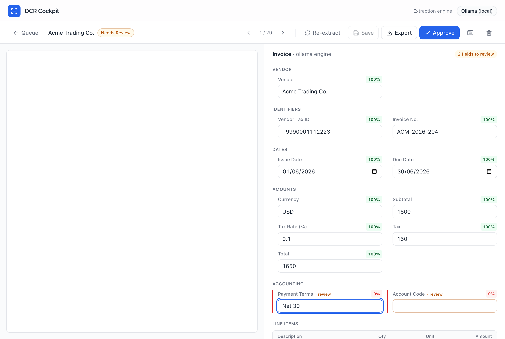
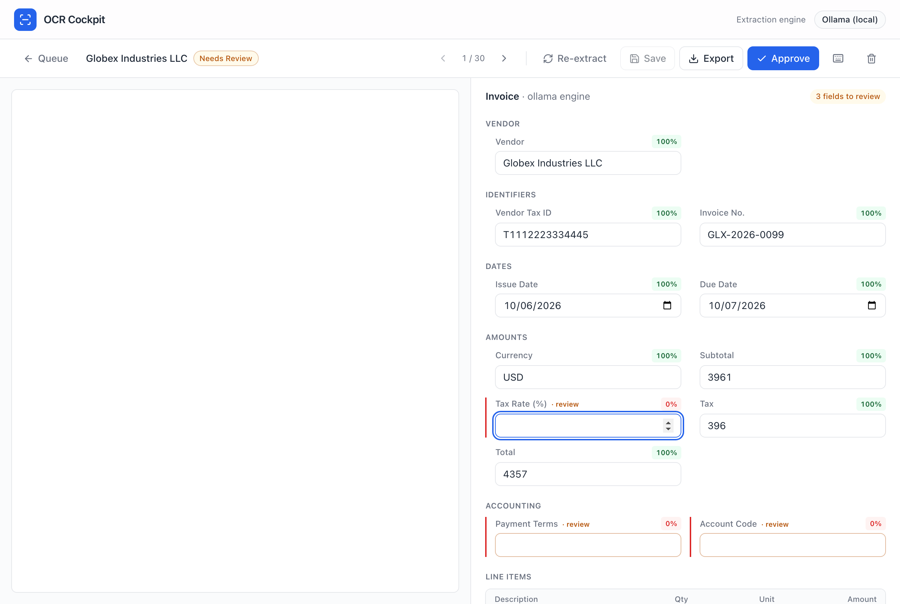
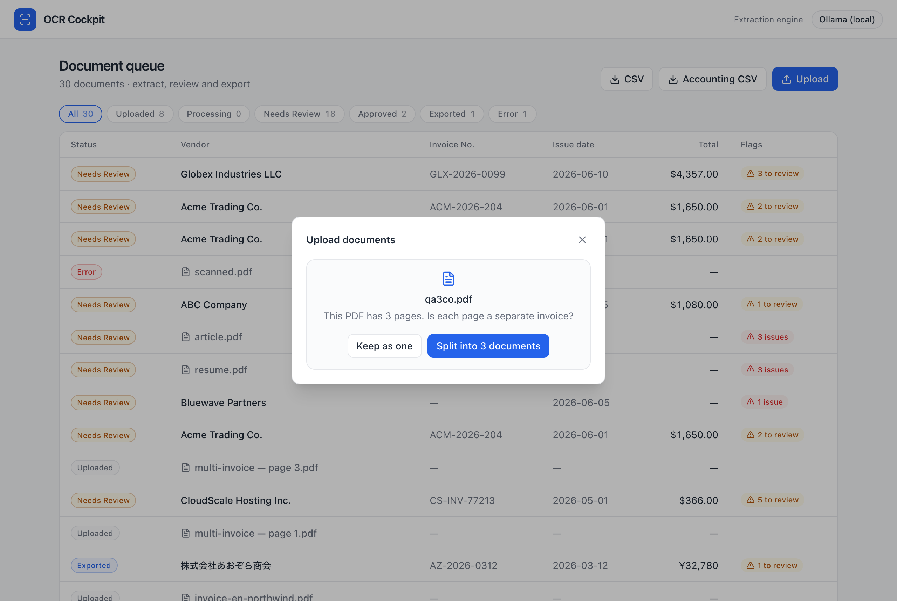
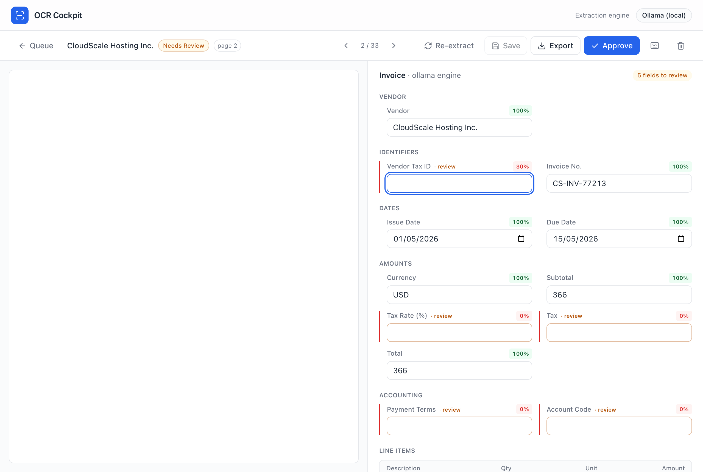
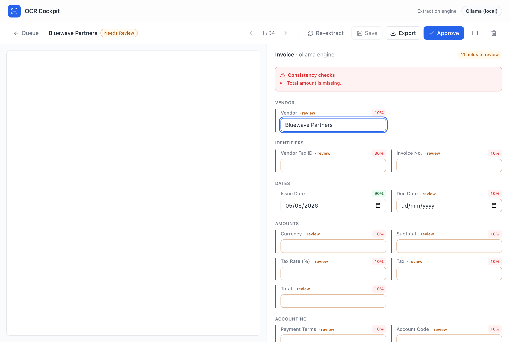
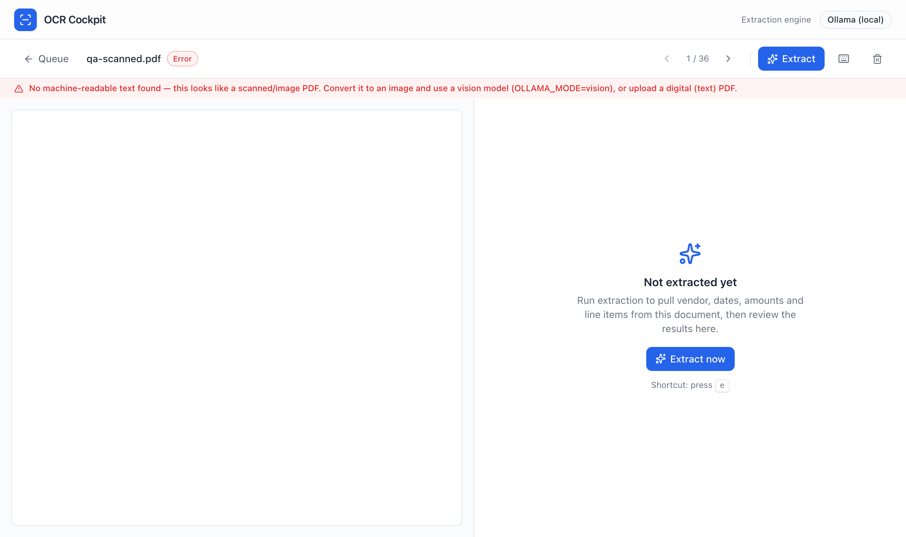

# PDF-type test results

End-to-end tests of how the cockpit handles different document types, run through
the real app (upload → extract → review) with the local vision engine
(`EXTRACTION_PROVIDER=ollama`, `OLLAMA_MODEL=qwen2.5vl:7b`; digital PDFs route to
text extraction). All inputs are **self-authored fictional documents — no PII**.
Generated with Playwright on 2026-06-14.

## Results

| # | Document type | Outcome | Screenshot |
|---|---|---|---|
| 1 | **Digital invoice** (baseline) | ✅ Acme Trading Co. · ACM-2026-204 · USD 1,650 — all fields 100% | [01](01-invoice-digital.png) |
| 2 | **Single invoice across 2 pages** (34 line items spanning pages, kept as one) | ✅ Globex · GLX-2026-0099 · USD 4,357 — **all 34 line items captured from both pages**, no warnings | [02](02-twopage-single-invoice.png) |
| 3 | **3 invoices in one PDF** → split into 3 | ✅ Upload prompts "split into 3?"; page 2 extracts the **correct** invoice (CloudScale · CS-INV-77213 · USD 366) | [03](03-split-confirm.png) · [04](04-split-page2-cloudscale.png) |
| 4 | **Non-invoice** (business letter) | ✅ Graceful: vendor guessed from letterhead, amounts **null**, "Total amount is missing" warning — no invented numbers | [05](05-non-invoice-letter.png) |
| 5 | **Scanned / image-only PDF** (no text layer) | ✅ **Refused** with a clear error instead of fabricating — "No machine-readable text found…" | [06](06-scanned-no-text.png) |

## Screenshots

### 1. Digital invoice (baseline)

### 2. Single invoice across two pages (kept as one)
All 34 line items — including those that flow onto page 2 — are captured into one record.

### 3. Three invoices in one PDF → split
Multi-page upload asks whether each page is a separate invoice:

After splitting, **page 2** extracts the correct second invoice (not the first):

### 4. Non-invoice (business letter)
Amounts stay empty and consistency checks flag the missing fields — nothing is invented.

### 5. Scanned / image-only PDF (no text layer)
The pipeline refuses rather than hallucinating a fake invoice:

## Key findings

- **Multi-page single invoice** → use "Keep as one" on upload; line items across pages
  are merged into one record correctly.
- **Multiple invoices in one PDF** → "Split into N documents" creates one document per
  page, each extracting only its own page (verified page 2 ≠ page 1).
- **Non-invoice documents with text** → safe: fields come back empty/low-confidence with
  consistency warnings; no fabricated values.
- **Scanned / image-only PDFs** (no embedded text) previously caused the model to
  **fabricate** a confident fake invoice. This is now guarded: extraction refuses with a
  clear error (and the reason persists on reload). True scanned-PDF support (rasterize
  pages → vision) is the planned follow-up.

## Test fixtures (source PDFs)

The exact PDFs used, in [`fixtures/`](fixtures/) — all fictional, no PII. Drag any of
them into the app's Upload dialog to reproduce a row above.

| File | Type | Pages |
|---|---|---|
| [`invoice-digital.pdf`](fixtures/invoice-digital.pdf) | Digital invoice (English) | 1 |
| [`invoice-2pages-single.pdf`](fixtures/invoice-2pages-single.pdf) | One invoice, 34 line items spanning 2 pages | 2 |
| [`invoice-3-companies.pdf`](fixtures/invoice-3-companies.pdf) | Three different invoices in one PDF | 3 |
| [`invoice-jp-tekikaku.pdf`](fixtures/invoice-jp-tekikaku.pdf) | Japanese 適格請求書 (registration no. + tax) | 1 |
| [`receipt.pdf`](fixtures/receipt.pdf) | Receipt | 1 |
| [`non-invoice-letter.pdf`](fixtures/non-invoice-letter.pdf) | Business letter (not an invoice) | 1 |
| [`non-invoice-resume.pdf`](fixtures/non-invoice-resume.pdf) | Résumé (not an invoice) | 1 |
| [`scanned-image-only.pdf`](fixtures/scanned-image-only.pdf) | Invoice rendered as an image — **no text layer** | 1 |

## Reproduce

Start the app with the local engine, then run an upload + extract for each fixture and
screenshot the review page. PDFs are generated from HTML via headless Chromium
(see `scripts/svg-to-pdf.mjs` for the rendering approach). The scanned fixture is an
invoice rendered to an image and embedded in a PDF (no text layer).
